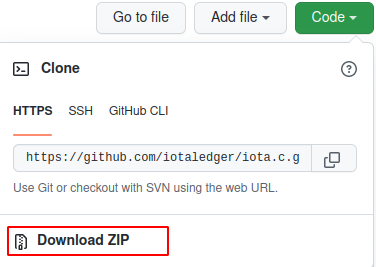
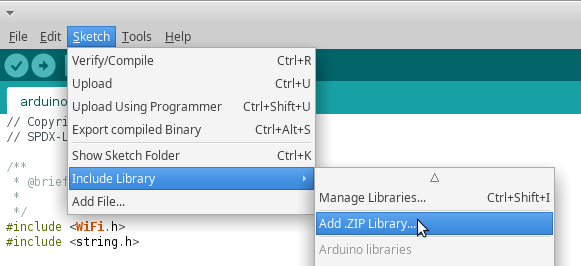
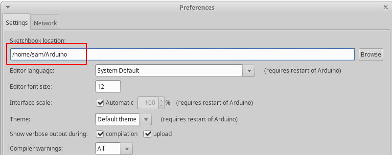
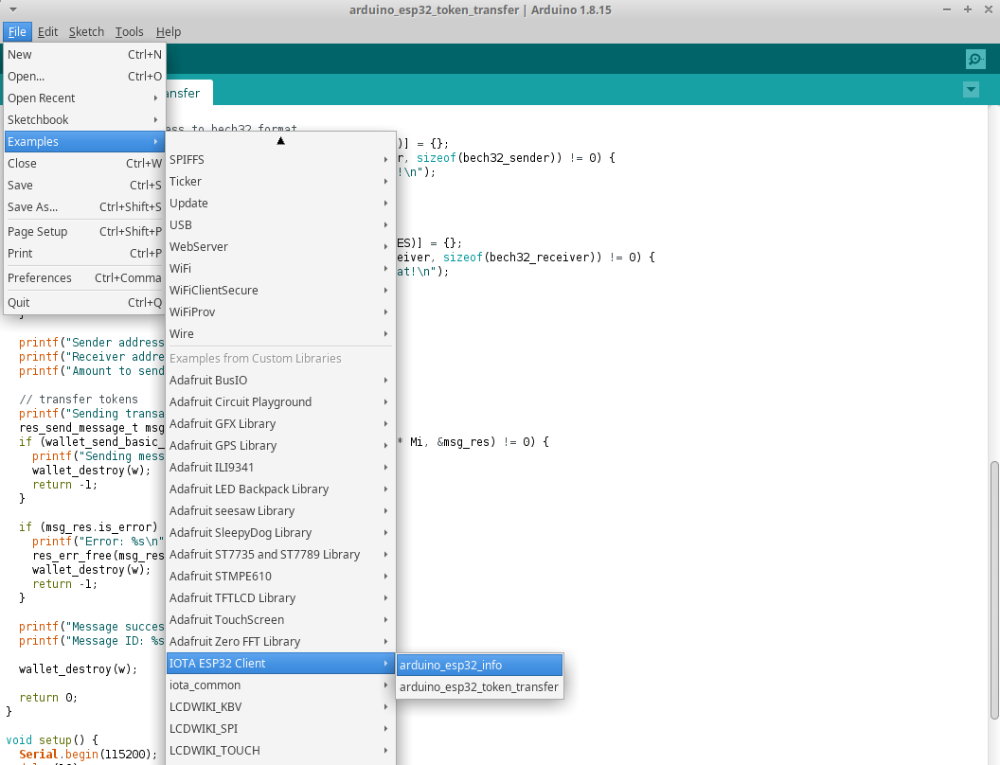

# Arduino IDE Integration

Developers are able to write IOTA client and wallet applications with [arduino-esp32](https://github.com/espressif/arduino-esp32) framework via the [Arduino Desktop IDE](https://www.arduino.cc/en/software)

Please follow the installation document to setup the IDE on your system

- [Install Arduino Desktop IDE](https://www.arduino.cc/en/Guide)
- [Install Arduino-ESP32 Support](https://docs.espressif.com/projects/arduino-esp32/en/latest/installing.html)


Once the desktop IDE and arduino-esp32 support are installed, you are ready to add IOTA Client library into the Arduino Libraries. 


There are two packages are required:

- [iota.c](https://github.com/iotaledger/iota.c)
- [uthash](https://github.com/oopsmonk/uthash)

## Import IOTA Client packages

Choose one way which your preferred to import packages into the Arduino IDE.

### Download Packages From GitHub

Download ZIP files from the website and save to a folder.



Add packages into Arduino Libraries



### Clone Packages From GitHub

Clone repositories into the Arduino Libraries folder, the folder is under the Sketchbook location can be found in the preferences settings.



In my case, it is `/home/sam/Arduino/libraries`.

```bash
cd /home/same/Arduino/libraries
git clone https://github.com/iotaledger/iota.c.git
git clone https://github.com/oopsmonk/uthash.git
```

### Import IOTA Client Library From Arduino Package Manager

TODO

## Open Examples from IDE

Once IOTA Client packages are imported to the Libraries folder, please restart Arduino IDE and you can find the examples in the IDE.



