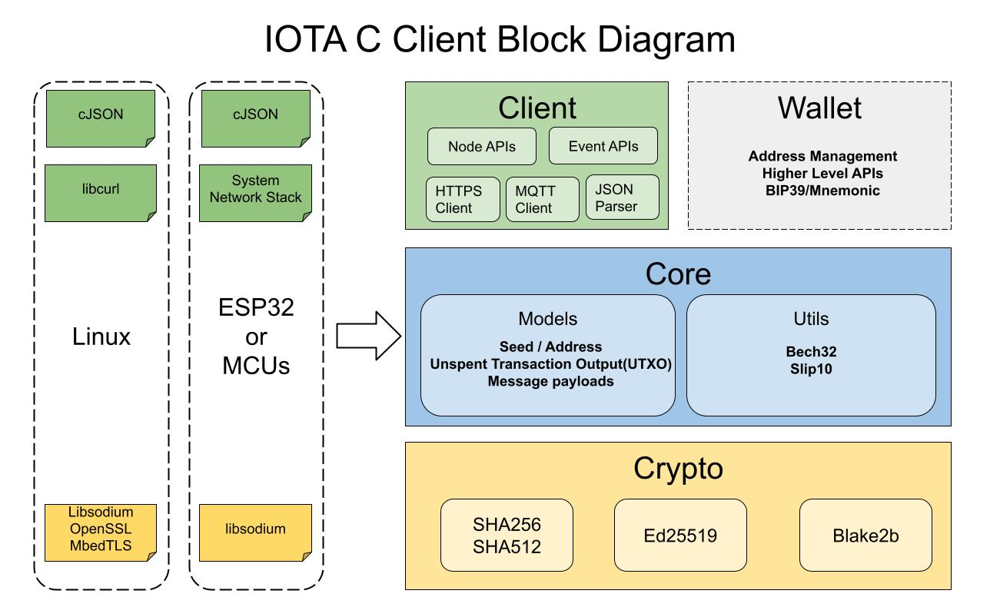
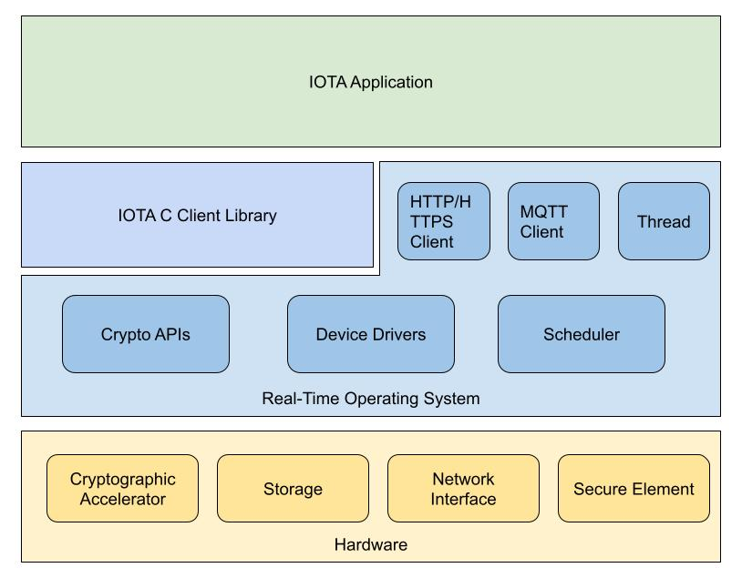

# Introduction

The C Client library is built for embedded development with microcontrollers and SoC(System on Chip). it can be ported to POSIX operating systems easily.

## C Client Library Diagram

The C Client library consists 4 abstraction layers:
* Crypto - provide cryptographic functions
* Core - implement components include address/message/UTXO...
* Client - implement node REST APIs. (optional)
* Wallet - simple wallet functions. (optional)

As a client application, Client and Wallet modules could be an option as needed. For instance, the application can implement its own wallet logic or it uses the Core module to compose messages then send messages through another interface without the Client module.

The C Client library relies on some functionalities from the operating system API or external library:
* HTTP/HTTPS Client
* JSON parser
* Crypto library

## IOTA Application Architecture

The real world application could be vary, here is an example architecture of an IOTA client application.

With the client library, you can interact with IOTA Tangle to:
* Create data and transaction messages
* Send data and transaction messages
* Query messages
* Query the node status
* Generate addresses

## Platform

It has ported to [ESP32](https://docs.espressif.com/projects/esp-idf/en/latest/esp32/hw-reference/esp32/get-started-devkitc.html) and [B-L4S5I-IOT01A](https://www.st.com/en/evaluation-tools/b-l4s5i-iot01a.html), find example projects in:
* ESP32 with PlatformIO - [Chrysalis CLI Wallet](https://github.com/oopsmonk/iota_c_platformIO/tree/dev_esp32_chrysalis)
* STM32 B-L4S5I-IOT01A with mBed OS - [iota-mbed-studio ](https://github.com/iotaledger/iota-mbed-studio)
