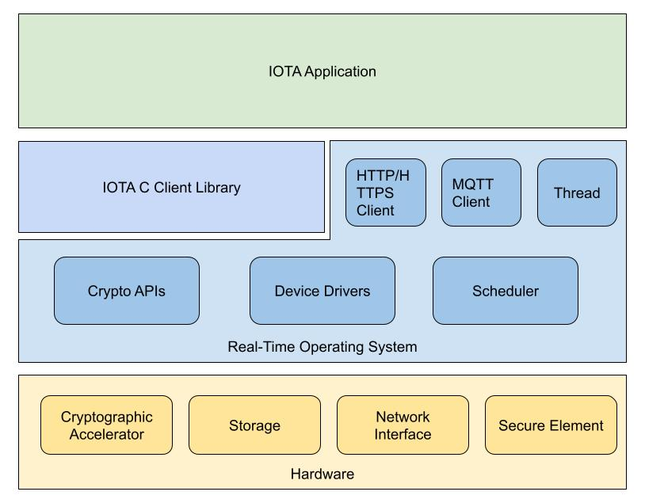

# Introduction

The C Client library is built for embedded development and can be integrated to POSIX operating systems easily.

It has integrated with Software Development Kits(SDK) and a STM32Cube expansion:
* [esp32-client-sdk](https://github.com/iotaledger/esp32-client-sdk) - based on ESP-IDF for ESP32 series
* [zephyr-client-sdk](https://github.com/iotaledger/zephyr-client-sdk) - based on ZephyrOS, supports hundreds of MCU out of the box, it works with nRF Connect SDK for Nordic microcontrollers as well.
* [iota-mbed-studio](https://github.com/iotaledger/iota-mbed-studio) - based on ARM Mbed OS and [Mbed Studio IDE](https://os.mbed.com/studio/).
* [X-CUBE-IOTA1](https://www.st.com/en/embedded-software/x-cube-iota1.html) - IOTA Distributed Ledger Technology software expansion for STM32Cube

## C Client Library Diagram

The C Client library consists 4 abstraction layers:
* Crypto - provides cryptographic functions
* Core - implements components include address/block/UTXO...
* Client - implements node REST APIs and Event APIs. (optional)
* Wallet - implements simple wallet functions. (optional)

As a client application, Client and Wallet modules could be an option as needed. For instance, the application can implement its own wallet logic or it uses the Core module to compose blocks then send blocks through another interface without the Client module.

The C Client library relies on some functionalities from the operating system API or external library:
* HTTP/HTTPS Client
* JSON parser
* Crypto library
* MQTT Client

## IOTA Application Architecture

The real world application could be vary, here shows an example of an IOTA client application.

With this design, the application can interact with IOTA Tangle in order to:
* Create data and transaction blocks
* Send data and transaction blocks
* Query blocks
* Query the node status
* Generate addresses
* Subscribe to node events

